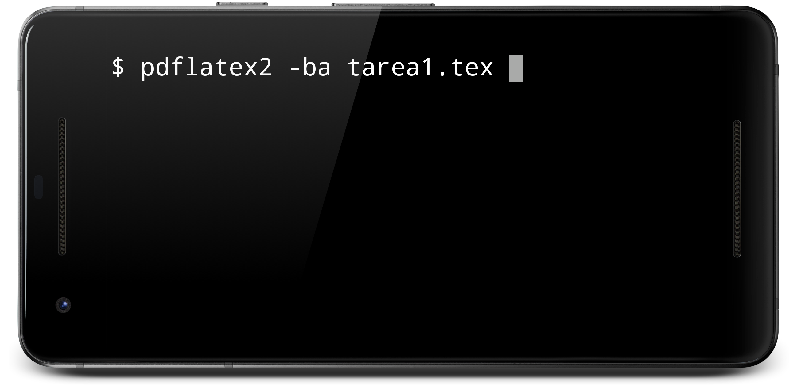
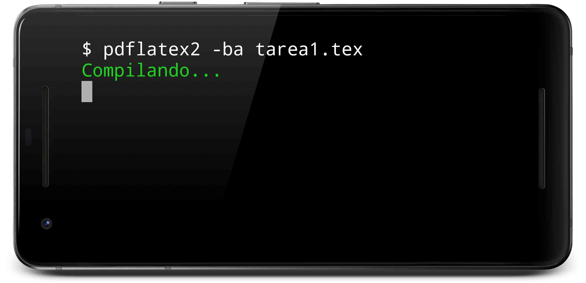
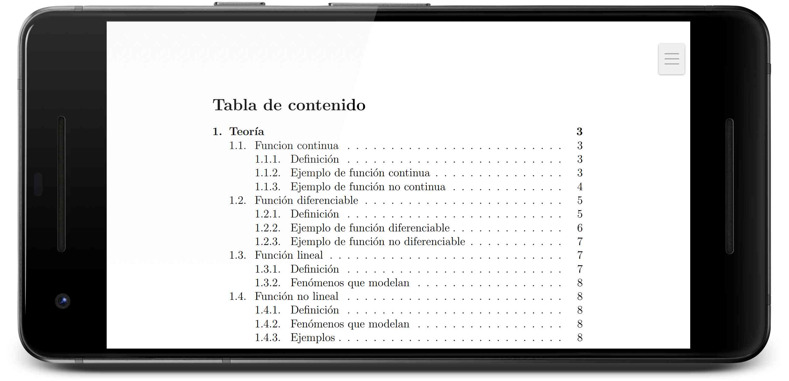

# [Termuxtex] (1.2.0) LaTeX for Termux 
Version (1.2.0) - <b> Modification date: 16/MAY/2019 </b> <br>
Changes in lualatex2ca, pdflatex2ca, pdflatex2c and pdflatex2ca scripts: [Scripts](#Scripts)<br>

In case that when compiling the .tex file shows error about some package not found but the package has already been installed it's necessary to perform a clean installation: [See clean installation](#3-Clean-installation)

[](LICENSE)
[](https://www.paypal.me/natanvilchis) <br>

LaTeX for Termux (Android). <br>
An automated script to install LaTeX and its main libraries for Termux <br>

*Read in other languages: [Spanish](README.md), [English](README.en.md)*


 
## Table of Contents
  - [Release notes](#Release-notes)
  - [Pre-requirements](#Pre-requirements)
    - [Write permissions activated](#Write-permissions-activated)
    - [Install Git](#Install-Git)
      - [1) Install Git:](#1-Install-Git)
      - [2) Accept the installation of Git:](#2-Accept-the-installation-of-Git)
      - [3) Wait until the installation finishes:](#3-Wait-until-the-installation-finishes)
  - [Installation](#Installation)
    - [1) Get TermuxTex](#1-Get-TermuxTex)
    - [2) Open the termuxtex folder](#2-Open-the-termuxtex-folder)
    - [3) Clean installation](#3-Clean-installation)
    - [4) Run the termuxtex.sh script](43-Run-the-termuxtex-script)
  - [Scripts](#Scripts)    
    - [lualatex2](#lualatex2)
    - [pdflatex2](#pdflatex2)
  - [Example](#Example)
    
	
## Release notes
Version (1.2.0) - <b> Modification Date: 16/MAY/2019 </b><br>
pdflatex2ca and pdflatex2c scripts were integrated into single one called: pdflatex2. <br>
lualatex2ca and lualatex2c scripts were integrated into a single one called: lualatex2. <br>
"inputenc" was removed from the default packages in the termuxtex installation. <br>
The option to perform a clean installation on devices that already have thermuxtex installed on the device is added.

Version (1.1.0) - <b>Modification date: 16/MAR/2019</b><br>
Added the download of the <b> texliveonfly </b> package to termuxtex.sh <br>
The pdflatex2ca, pdflatex2c, lualatex2ca and lualatex2c files were modified so that they automatically installed the missing packages from the file to be compiled (thanks to the texliveonfly package). <br>
A correction was added to the files pdflatex2ca, pdflatex2c, lualatex2ca and lualatex2c so that they can compile files that do not use bibliographic references. <br>

Version (1.0.0) <b> Modification date: 18/NOV/2018 </b> <br>
The first version of the repository is added

## Pre-requirements
It is necessary to have approximately <b> 340 MB </b> of free space for a correct installation (the size may vary for later updates).


### Write permissions activated
Have the Termux write permissions enabled (Settings => Apps => Termux => Permissions => Storage) <br>


### Install Git
Install git in Termux:
#### 1) Install Git:
Execute the following command in termux: <br>
```
pkg install git
```


 <br>
#### 2) Accept the installation of Git:
 <br>
#### 3) Wait until the installation finishes:
 <br>

## Installation
### 1) Get TermuxTex
In Termux execute the following command:
````
git clone https://github.com/NatanVilchis/termuxtex
````
 <br>
Wait until the entire repository is finished: <br>
 <br>
### 2) Open the termuxtex folder
In Termux execute the following command:
````
cd termuxtex
````
 <br>


### 3) Clean installation
Si no ha instalado termuxtex en este dispositivo omita este paso. <br>
It's recommended to perform a clean installation if termuxtex is currently installed in Termux, in order to avoid possible errors such as the following: [Latex can't find .sty files altough packages are installed](https://tex.stackexchange.com/questions/158700/latex-cant-find-sty-files-altough-packages-are-installed-texlive-ubuntu-12). <br>
The following commands will purge the old LaTeX installation and remove the old configuration files. <br>
To perform the clean installation you must write the following in Termux:
````
apt-get -y purge texlive*
rm -rf $HOME/../usr/share/texlive/
rm -rf $HOME/.texlive*
````

### 4) Run the termuxtex script
In Termux execute the following command:
````
bash termuxtex.sh
````
<b>It is important that while the installation is in process the equipment is not suspended as it may cause installation problems</b><br>
 <br>
Wait for the installation to finish:
 <br>

## Scripts
To simplify the scripts the following changes have been made: <br>
lualatex2ca and lualatex2c will be integrated in "lualatex2" <br>
ppdflatex2ca and pdflatex2c will be integrated in "pdflatex2" <br>
 

### lualatex2
This command will compile the .tex file with lualatex <br>
The general form of use is the following:
````
lualatex2 [-options] file.tex
````
Options: <br>
-b, If the .tex file contains references like bibtex, apacite ... <br>
-o, If you want to open the PDF file automatically after compilation. <br>
If there are no options, only the PDF file will be compiled. <br>
Examples: <br>
Compile:
````
lualatex2 file.tex
````
Compile and open automatically:
````
lualatex2 -o file.tex
````
Compile, generate references and automatically open:
````
lualatex2 -ob file.tex
````
It can also be used:
````
lualatex2 -bo file.tex
````

### pdflatex2
This command will compile the .tex file with pdflatex <br>
The general form of use is the following:
````
pdflatex2 [-options] archivo.tex
````
Options: <br>
-b, If the .tex file contains references like bibtex, apacite ... <br>
-o, If you want to open the PDF file automatically after compilation. <br>
If there are no options, only the PDF file will be compiled. <br>
Examples: <br>
Compile:
````
pdflatex2 archivo.tex
````
Compile and open automatically:
````
pdflatex2 -o file.tex
````
Compile, generate references and open automatically:
````
pdflatex2 -ob file.tex
````
It can also be used:
````
pdflatex2 -bo file.tex
````

## Example
This repository has an example to use with termuxtex. <br>
Inside the termuxtex folder write the following: <br>
````
cd example
````
<br>
 <br> <br>

Since the example has bibliographic references, the following can be used: <br>
````
pdflatex2 -bo tarea1.tex
````
 <br> <br>
Wait for it to finish compiling: <br>
 <br>

It can also be compiled using lualatex2:
````
lualatex2 -bo tarea1.tex
````

Once compiled the file will be open automatically: <br>
 <br>

To see the full list of options that can be passed to lualatex2 and pdflatex2 see: [Scripts](#Scripts)


## Made by
[Natan Vilchis] (https://natanvilchis.org) <br> 

## License
This project is licensed under the MIT license, see [LICENSE](LICENSE) to see the details.
