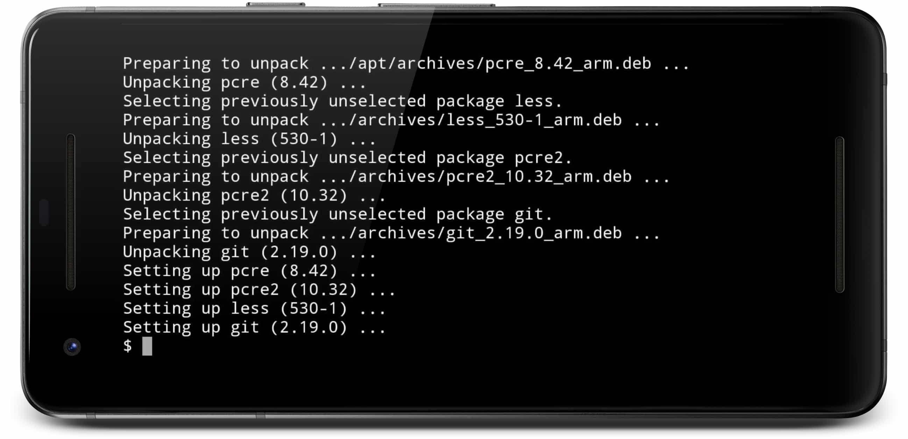
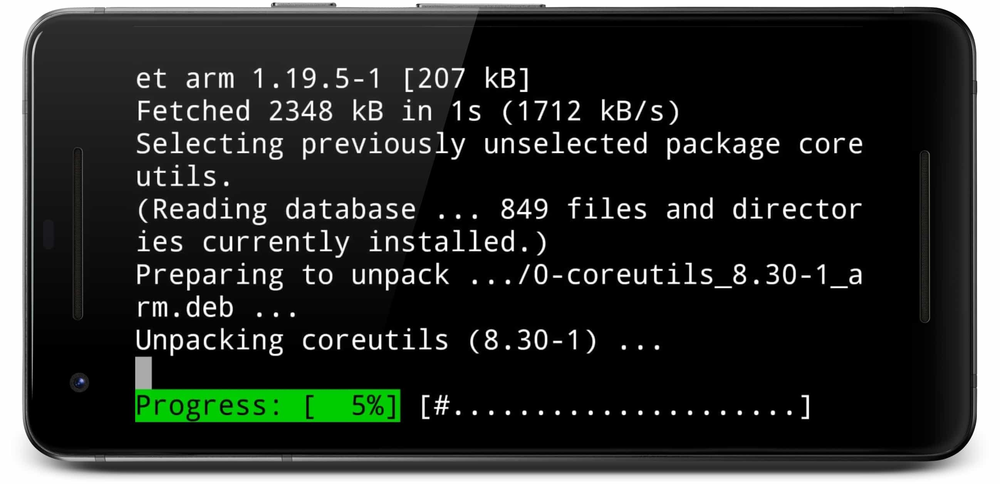

# [Termuxtex] (1.0.0) LaTeX for Termux 
[](LICENSE)
[](https://www.paypal.me/natanvilchis) <br>

LaTeX for Termux (Android). <br>
An automated script to install LaTeX and its main libraries for Termux <br>

*Read in other languages: [Spanish](README.md), [English](README.en.md)*


 
## Table of Contents
  - [Release notes](#Release-notes)
  - [Pre-requirements](#Pre-requirements)
    - [Write permissions activated](#Write-permissions-activated)
    - [Install Git](#Install-Git)
      - [1) Install Git:](#1-Install-Git)
      - [2) Accept the installation of Git:](#2-Accept-the-installation-of-Git)
      - [3) Wait until the installation finishes:](#3-Wait-until-the-installation-finishes)
  - [Installation](#Installation)
    - [1) Get TermuxTex](#1-Get-TermuxTex)
    - [2) Open the termuxtex folder](#2-Open-the-termuxtex-folder)
    - [3) Run the termuxtex.sh script](#3-Run-the-termuxtex-script)
  - [Example](#Example)
    - [1) Go to the example folder](#1-Go-to-the-example-folder)
    - [Command 1) lualatex2ca (recommended)](#Command-1-lualatex2ca-recommended)
    - [Command 2) lualatex2c](#Command-2-lualatex2c)
    - [Command 3) pdflatex2ca](#Command-3-pdflatex2ca)
    - [Command 4) pdflatex2c](#Command-4-pdflatex2c)
    
	
## Release notes
Version (1.0.0) <b> Date modified: 18/NOV/2018 </b> <br>
The first version of the repository is added

## Pre-requirements
It is necessary to have approximately <b> 340 MB </b> of free space for a correct installation (the size may vary for later updates).


### Write permissions activated
Have the Termux write permissions enabled (Settings => Apps => Termux => Permissions => Storage) <br>


### Install Git
Install git in Termux:
#### 1) Install Git:
Execute the following command in termux: <br>
```
pkg install git
```


 <br>
#### 2) Accept the installation of Git:
 <br>
#### 3) Wait until the installation finishes:
 <br>

## Installation
### 1) Get TermuxTex
In Termux execute the following command:
````
git clone https://github.com/NatanVilchis/termuxtex
````
 <br>
Wait until the entire repository is finished: <br>
 <br>
### 2) Open the termuxtex folder
In Termux execute the following command:
````
cd termuxtex
````
 <br>

### 3) Run the termuxtex script
In Termux execute the following command:
````
bash termuxtex.sh
````
<b>It is important that while the installation is in process the equipment is not suspended as it may cause installation problems</b><br>
 <br>
Wait for the installation to finish:
 <br>


## Example
This repository has an example to be able to create a PDF document from a file in LaTeX <br>

### 1) Go to the example folder
For each of the following 4 commands it was executed inside the example folder. <br> <br>
Write the following command in termux: <br>
````
cd ejemplo
````
<br>

 <br><br>

<b>There are 4 pre-installed commands together with termuxtex, which automate the compilation of the file in LaTeX</b><br>

### Command 1) lualatex2ca (recommended)
This command automatically compiles and opens the PDF generated file. <br>
You must first write lualatex2ca followed by the main file name in LaTeX <b> WITHOUT the .tex extension </b> <br>

Example: <br>
````
lualatex2ca tarea1
````
<br>
 <br>


Wait for it to finish compiling ... <br>
 <br>
Generated PDF (the PDF will be saved in the folder where it is being executed):
 
 <br>
 
### Command 2) lualatex2c
This command only compiles to a PDF file. <br>
You must first write lualatex2c followed by the main file name in LaTeX <b> WITHOUT the .tex extension </b> <br>
Example: <br>
````
lualatex2c tarea1
````
<br>
 <br>

Wait for it to finish compiling ... <br>
 <br>

### Command 3) pdflatex2ca
This command automatically compiles and opens the PDF generated file. <br>
You must first write pdflatex2ca followed by the main file name in LaTeX <b> WITHOUT the .tex extension </b> <br>

Example: <br>
````
pdflatex2ca tarea1
````
<br>
 <br>


Wait for it to finish compiling ... <br>
 <br>
Generated PDF (the PDF will be saved in the folder where it is being executed):
 
 <br>


### Command 4) pdflatex2c
This command only compiles to a PDF file. <br>
First write pdflatex2c followed by the main file name in LaTeX <b> WITHOUT the extension .tex </b> <br>
Example: <br>
````
pdflatex2c tarea1
````
<br>
 <br>

Wait for it to finish compiling ... <br>
 <br>


## Made by
[Natan Vilchis] (https://natanvilchis.org) <br> 

## License
This project is licensed under the MIT license, see [LICENSE](LICENSE) to see the details.
