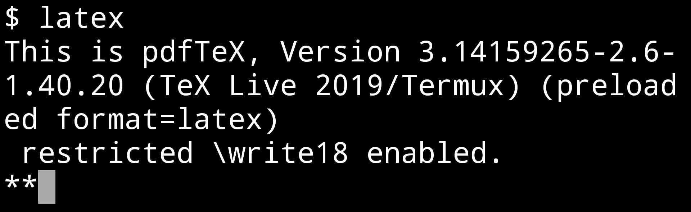
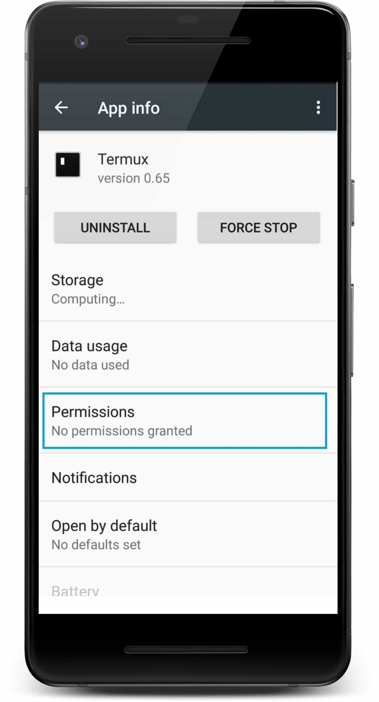
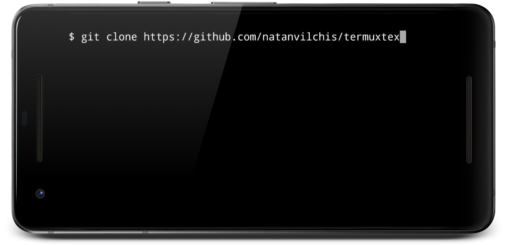
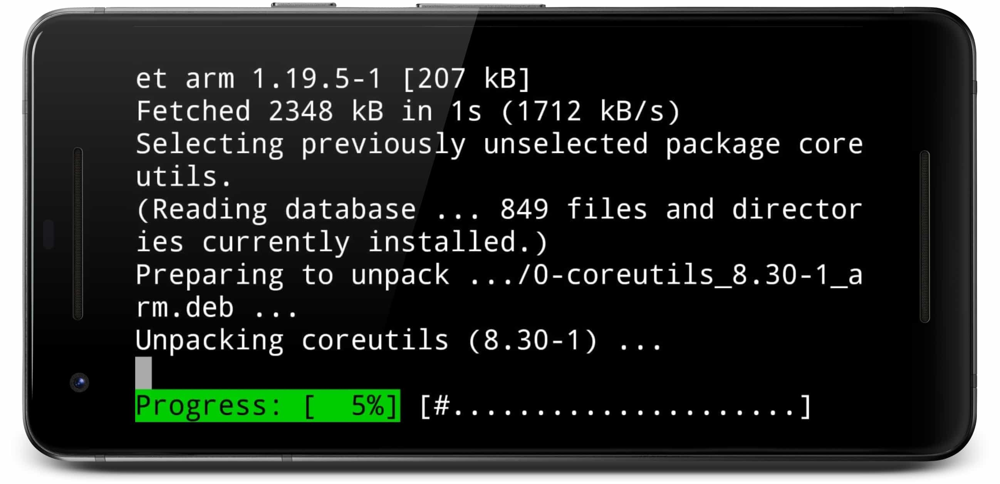

# [Termuxtex] (1.2.0) LaTeX para Termux
Versión (1.2.0) - <b>Modificación: 16/MAY/2019</b><br>
Cambios en los scripts: [Scripts](Scripts)<br> 


En caso de que al compilar el archivo .tex muestre error sobre algún paquete no encontrado pero ya se ha instalado el paquete es necesario realizar una instalación limpia: [Ver instalación limpia](#3-Instalación-limpia)

[](LICENSE)
[](https://www.paypal.me/natanvilchis) <br>

LaTeX para Termux (Android). <br>
Un script automatizado para instalar LaTeX y sus principales bibliotecas para Termux <br>

*Leer en otros lenguajes: [Español](README.md), [Inglés](README.en.md)*


 
 
## Tabla de contenido
  - [Notas de la versión](#notas-de-la-versión)
  - [Pre-requisitos](#pre-requisitos)
    - [Permisos de escritura activados](#permisos-de-escritura-activados)
    - [Instalar Git](#instalar-git)
      - [1) Instalar Git:](#1-instalar-git)
      - [2) Aceptar la instalación de Git:](#2-aceptar-la-instalación-de-git)
      - [3) Esperar hasta que la instalación termine:](#3-esperar-hasta-que-la-instalación-termine)
  - [Instalación](#instalación)
    - [1) Obtener TermuxTex](#1-Obtener-TermuxTex)
    - [2) Abrir la carpeta termuxtex](#2-Abrir-la-carpeta-termuxtex)
    - [3) Instalación limpia](#3-Instalación-limpia)
    - [4) Ejecutar el script termuxtex](#3-Ejecutar-el-script-termuxtex)
  - [Scripts](#Scripts)    
  - [Ejemplo ](#ejemplo)
    - [1) Dirigirse a la carpeta ejemplo ](#1-Dirigirse-a-la-carpeta-ejemplo)
    - [Cambios en los scripts](#cambios-en-los-scripts)
    - [Comando 1) lualatex2)](#Comando-1-lualatex2)
    - [Comando 2) pdflatex2)](#Comando-3-pdflatex2)
    
	
## Notas de la versión
Versión (1.1.0) - <b>Fecha de Modificación: 16/MAR/2019</b><br>
Se agregó la descarga del paquete <b>texliveonfly</b> en termuxtex.sh <br> 
Se modificaron los archivos pdflatex2ca, pdflatex2c, lualatex2ca y lualatex2c para que automáticamente instalaran los paquetes faltantes del archivo a compilar (gracias al paquete texliveonfly). <br>
Se añadió una corrección a los archivos pdflatex2ca, pdflatex2c, lualatex2ca y lualatex2c para que puedan compilar archivos que no usen referencias bibliográficas.<br>


Versión (1.0.0) <b>Fecha de Modificación: 18/NOV/2018</b><br>
Se añade la primer versión del repositorio

## Pre-requisitos
Es necesario contar con aproximadamente <b>340 MB</b> de espacio libre para una correcta instalación (el tamaño puede variar para actualizaciones posteriores).


### Permisos de escritura activados
Tener activados los permisos de escritura de Termux (Ajustes => Apps => Termux => Permisos => Almacenamiento) <br>




### Instalar Git
Instalar git en Termux:  
#### 1) Instalar Git:
Ejecutar en termux el siguiente comando: <br> 
```
pkg install git
```
 

 <br>
#### 2) Aceptar la instalación de Git:
 <br>
#### 3) Esperar hasta que la instalación termine:
 <br>

## Instalación
### 1) Obtener TermuxTex
En Termux ejecutar el siguiente comando:
````
git clone https://github.com/NatanVilchis/termuxtex
````
 <br>
Esperar a que se termine de obtener todo el repositorio: <br>
 <br>
### 2) Abrir la carpeta termuxtex
En Termux ejecutar el siguiente comando:
````
cd termuxtex
````
 <br>

### 3) Instalación limpia
Si no ha instalado termuxtex en este dispositivo omita este paso. <br>
Se recomienda realizar una instalación limpia si actualmente está instalado termuxtex en Termux, esto con la finalidad de evitar posibles errores como el siguiente: [Latex can't find .sty files altough packages are installed](https://tex.stackexchange.com/questions/158700/latex-cant-find-sty-files-altough-packages-are-installed-texlive-ubuntu-12). <br>
Los siguientes comandos purgarán la instalación vieja y eliminarán los archivos de configuración viejos. <br>
Para realizar la instalación limpia en Termux se debe escribir lo siguiente:
````
apt-get -Y purge texlive*
rm -rf $HOME/../usr/share/texlive/
rm -rf $HOME/.texlive*
````

 

### 3) Ejecutar el script termuxtex
En Termux ejecutar el siguiente comando:
````
bash termuxtex.sh
````
<b>Es importante que mientras la instalación esté en proceso el equipo no se suspenda ya que puede generar problemas de instalación</b><br>
 <br>
Esperar a que termine la instalación:
 <br>

## Scripts
Para simplificar los scripts se han hecho los siguientes cambios:<br>
lualatex2ca y lualatex2c estarán integrados en solo script llamado "lualatex2" <br>
ppdflatex2ca y pdflatex2c estarán integrados en solo script llamado "pdflatex2" <br>
 

### Comando 1) lualatex2
Este comando compilará el archivo con lualatex<br>
La forma general de uso es la siguiente:
````
lualatex2 [-opciones] archivo.tex
````
Opciones:<br>
-b, Si el archivo.tex contiene referencias como bibtex, apacite...<br>
-a, Si desea abrir el archivo PDF automáticamente después de la compilación.<br>
Si no hay opciones solamente se compilará el archivo en PDF.<br>
Ejemplos de uso:
Compilar solamente:  
````
lualatex2 archivo.tex
````
Compilar y abrir automáticamente:  
````
lualatex2 -a archivo.tex
````
Compilar, generar las referencias y abrir automáticamente:  
````
lualatex2 -ab archivo.tex
````
También puede usarse:
````
lualatex2 -ba archivo.tex
````

### Comando 2) pdflatex2
Este comando compilará el archivo con pdflatex<br>
La forma general de uso es la siguiente:
````
pdflatex2 [-opciones] archivo.tex
````
Opciones:<br>
-b, Si el archivo.tex contiene referencias como bibtex, apacite...<br>
-a, Si desea abrir el archivo PDF automáticamente después de la compilación.<br>
Si no hay opciones solamente se compilará el archivo en PDF.<br>
Ejemplos de uso:
Compilar solamente:  
````
pdflatex2 archivo.tex
````
Compilar y abrir automáticamente:  
````
pdflatex2 -a archivo.tex
````
Compilar, generar las referencias y abrir automáticamente:  
````
pdflatex2 -ab archivo.tex
````
También puede usarse:
````
pdflatex2 -ba archivo.tex
````


### 1) Dirigirse a la carpeta ejemplo
Para cada uno de los siguientes 4 comandos se ejecutó dentro de la carpeta de ejemplo. <br>
Escribir en termux el siguiente comando: <br>
````
cd ejemplo
````
<br>
 <br><br>

Como el ejemplo tiene referencias bibliográficas se puede usar lo siguiente:<br>
````
pdflatex2 -ba archivo.tex
````
También puede compilarse usando lualatex2:
````
lualatex2 -ba archivo.tex
````
Para ver la lista de opciones que pueden pasarse a lualatex2 y pdflatex2 ver [Scripts](Scripts)

## Hecho por 
[Natan Vilchis](https://natanvilchis.org) <br>

## Licencia
Este proyecto está licenciado bajo la licencia MIT, ver  [LICENSE](LICENSE) para ver los detalles.
