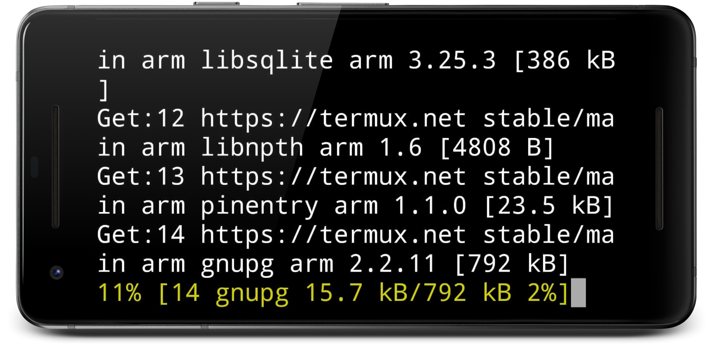

# [Termuxtex] (1.0.0) LaTeX para Termux 
[](LICENSE)
[](https://www.paypal.me/natanvilchis) <br>

LaTeX para Termux (Android). <br>
Un script automatizado para instalar LaTeX y sus principales bibliotecas para Termux <br>

*Leer en otros lenguajes: [Español](README.md), [Inglés](README.en.md)*


 
 
## Tabla de contenido
  - [Notas de la versión](#notas-de-version)
  - [Pre-requisitos](#pre-requisitos)
    - [Permisos de escritura activados](#escritura-activados)
    - [Instalar Git](#instalar-git)
      - [1) Instalar Git:](#instalamos-git)
      - [2) Aceptar la instalación de Git:](#aceptar-instalacion-git)
      - [3) Esperar hasta que la instalación termine:](#esperar-git)
  - [Instalación ](#instalacion)
    - [1) Obtener TermuxTex](#obtener-termuxtex)
    - [2) Abrir la carpeta termuxtex](#abrir-termuxtex)
    - [3) Ejecutar el script termuxtex.sh](#ejecutar-script-termuxtex)
  - [Ejemplo ](#ejemplo)
    - [1) Dirigirse a la carpeta ejemplo ](#carpeta-ejemplo)
    - [Comando 1) lualatex2ca (recomendado)](#lualatex2ca)
    - [Comando 2) lualatex2c](#lualatex2c)
    - [Comando 3) pdflatex2ca ](#pdflatex2ca)
    - [Comando 4) pdflatex2c](#pdflatex2c)
    
	
## Notas de la versión
Versión (1.0.0) <b>Fecha de modificación: 18/NOV/2018</b><br>
Se añade la primer versión del repositorio

## Pre-requisitos
Es necesario contar con aproximadamente <b>340 MB</b> de espacio libre para una correcta instalación (el tamaño puede variar para actualizaciones posteriores).


### Permisos de escritura activados
Tener activados los permisos de escritura de Termux (Ajustes => Apps => Termux => Permisos => Almacenamiento) <br>


### Instalar Git
Instalar git en Termux:  
#### 1) Instalar Git:
Ejecutar en termux el siguiente comando: <br> 
```
pkg install git
```


 <br>
#### 2) Aceptar la instalación de Git:
 <br>
#### 3) Esperar hasta que la instalación termine:
 <br>

## Instalación
### 1) Obtener TermuxTex
En Termux ejecutar el siguiente comando:
````
git clone https://github.com/NatanVilchis/termuxtex
````
 <br>
Esperar a que se termine de obtener todo el repositorio: <br>
 <br>
### 2) Abrir la carpeta termuxtex
En Termux ejecutar el siguiente comando:
````
cd termuxtex
````
 <br>

### 3) Ejecutar el script termuxtex.sh
En Termux ejecutar el siguiente comando:
````
bash termuxtex.sh
````
<b>Es importante que mientras la instalación esté en proceso el equipo no se suspenda ya que puede generar problemas de instalación</b><br>
 <br>
Esperar a que termine la instalación:
 <br>


## Ejemplo
Este repositorio cuenta con un ejemplo para poder crear un documento PDF a partir de una archivo en LaTeX<br>

### 1) Dirigirse a la carpeta ejemplo
Para cada uno de los siguientes 4 comandos se ejecutó dentro de la carpeta de ejemplo. <br>
Escribir en termux el siguiente comando: <br>
````
cd ejemplo
````
<br>

 <br><br>

<b>Existen 4 comandos pre-instalados junto termuxtex, los cuales automatizan la compilación del archivo en LaTeX</b><br>

### Comando 1) lualatex2ca (recomendado)
Este comando compila y abre automáticamente el archivo generado PDF.<br>
Se debe escribir primero lualatex2ca seguido del nombre de archivo principal en LaTeX <b>SIN la extensión .tex</b><br>

Ejemplo:<br>
````
lualatex2ca tarea1
````
<br>
 <br>


Esperar a que termine de compilar... <br>
 <br>
PDF generado (el PDF se guardará en la carpeta donde se está ejecutando):
 
 <br>
 
### Comando 2) lualatex2c
Este comando sólo compila a un archivo PDF.<br>
Se debe escribir primero lualatex2c seguido del nombre de archivo principal en LaTeX <b>SIN la extensión .tex</b><br>
Ejemplo:<br>
````
lualatex2c tarea1
````
<br>
 <br>

Esperar a que termine de compilar... <br>
 <br>

### Comando 3) pdflatex2ca 
Este comando compila y abre automáticamente el archivo generado PDF.<br>
Se debe escribir primero pdflatex2ca seguido del nombre de archivo principal en LaTeX <b>SIN la extensión .tex</b><br>

Ejemplo:<br>
````
pdflatex2ca tarea1
````
<br>
 <br>


Esperar a que termine de compilar... <br>
 <br>
PDF generado (el PDF se guardará en la carpeta donde se está ejecutando):
 
 <br>


### Comando 4) pdflatex2c
Este comando sólo compila a un archivo PDF.<br>
Se debe escribir primero pdflatex2c seguido del nombre de archivo principal en LaTeX <b>SIN la extensión .tex</b><br>
Ejemplo:<br>
````
pdflatex2c tarea1
````
<br>
 <br>

Esperar a que termine de compilar... <br>
 <br>


## Hecho por 
[Natan Vilchis](https://natanvilchis.org) <br>
Repositorio usado para ayuda de este script: [its-pointless-gcc_termux](https://github.com/its-pointless/gcc_termux)

## Licencia
Este proyecto está licenciado bajo la licencia MIT, ver  [LICENSE](LICENSE) para ver los detalles.
